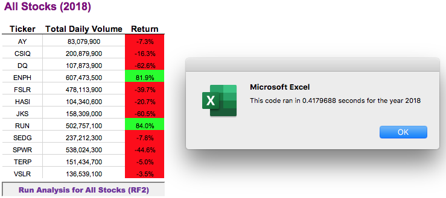

# Green Energy Stock Performance Analysis Project

## Overview
### Background

Steve, newly graduated with a Finance degree, wants to put his recently honed skills to work and help his parents with their investments. Being passionate about green energy, but knowing very little about this industry and its various sectors, Steve's parents picked a stock based on its ticker symbol: **DQ**.  

To help provide some insight into the performance of various stocks in alternative energy, Steve wants to be able to track several companies at once. Writing code in Visual Basic to summarize and analyze 12 green energy stocks gets Steve the information he is looking for, but what if he wants to expand the number of stocks he's tracking to further his research? 

The existing code works well for 12 stocks but what if Steve wants to expand his research to inlcude thousands of stocks?

### Purpose

The purpose of this exercise is twofold: 

1. To **refactor** existing code that looks at the stock performance for 12 companies to improve the code's efficiency so when applied to large data sets, the code will not cause any runtime errors or take too long to run.
2. To help Steve's parents understand how well their stock pick, DQ, performed 2018 vs 2017, compared to other stocks. 

***Refactoring Code is the process of taking existing code and improving its structure, design, or implementation, without changing or compromising the functionality of the code.***

 
## Resources 
The data used for this analysis is found in the **Excel** workbook, **VBA_Challenge.xls**, which contains data for the full year 2017 and full year 2018 on two separate worksheets (tabs). Daily data was tracked for 12 stocks in the green energy sector; below is a list of data that is used for this analysis.  

* Ticker Symbol ("ticker")
* Opening Value ("open")
* Closing Value ("close")
* Daily Stock Trading Volume ("volume")

The developer tools within Excel were utilized to write macros or subroutines in **Visual Basic (VBA)** to summarize the Total Daily Volume and the Annual Rate of Return for each of the 12 stocks for a specified year.

*Additional data points are included in the raw data, but were not needed for the purposes of this analysis.*

## Method

The complete subroutines, with full comments, can be found in **VBA_Challenge.xlsm** included in this repository.  The VBA module "AllStocksAnalysisOG" contains the original subroutine AllStocksAnalysis() and module "AllStocksAnalysisRefactored" contains the refactored code, AllStocksAnalysisRefactored().

The functionality of the code - original and refactored - is the same:  

* Collect input from end-user to call the correct data set; i.e. which year to perform analysis (2017 or 2018).
* Read in the data to correctly in order to:
	1. output the stock's Ticker symbol,
	2. specified year's total volume: initializing to 0 and keeping a running total per stock, 
	3. to identify the starting price and ending price of each stock to calculate and output the return per stock for the selected year.
* Apply conditional formatting to visualize stocks with either a positive or negative return. 

Specific code elements are kept the same deliberately to isolate the effects the refactoring has on the processing of data. These include: 

1. A timer in both macros is used to capture the runtime; it starts and stops at the same point in the process.

 * ```startTime = Timer``` is placed after the input box requesting the specific year
 * ```endTime = Timer``` is placed after the final formatting for the output
 
2.  The formatting of the output is exactly the same to eliminate the possibility any variation in formatting could result in longer or shorter runtime.
 
 
Those are the similiarities, so how was the original code improved, refactored?
The most impactful difference in these two macros is the original code utilizes a nested ```for``` loop to where the refactored code uses only one.  

#### **Original VBA Code: AllStocksAnalysis() Nested ```For``` Loop Excerpt**  

      'Loop through the tickers
       For i = 0 To 11
       		'Initialize totalVolume to zero for current ticker.
       		 ticker = tickers(i)
       		 totalVolume = 0
       		
          	'Activate data workSheet.
          	 Worksheets(yearValue).Activate  
                     
           For j = 2 To RowCount
            	'Find the total volume for the current ticker.
            	 If Cells(j, 1).Value = ticker Then
    					totalVolume = totalVolume + Cells(j, 8).Value
             	 End If                 

				'Find the starting price for the current ticker.
            	 If Cells(j - 1, 1).Value <> ticker And Cells(j, 1) = ticker Then
                	 	startingPrice = Cells(j, 6).Value
   				 End If

    			'Find the ending price for the current ticker.
   				 If Cells(j + 1, 1).Value <> ticker And Cells(j, 1) = ticker Then
                    	endingPrice = Cells(j, 6).Value
           		 End If    
           Next j
        
        	'Output values and calculate return to output sheet.
        	 Worksheets("All Stocks Analysis").Activate
        	 Cells(4 + i, 1).Value = ticker
        	 Cells(4 + i, 2).Value = totalVolume
        	 Cells(4 + i, 3).Value = (endingPrice / startingPrice) - 1
        Next i

This code calls for reading or looping through the full data set for the specified year 12 times in order to identify "startingPrice", "endingPrice" and the "totalVolume" for each of the 12 stock tickers. In addition, at the end of each iteration, a summary of the ticker is output to the results worksheet "All Stocks Analysis".
   
However, with the refactored code, the macro only reads or loops through data 
set one time; the output to the summary chart occurs outside of the ```For``` loop further increasing the code's efficiency:  

#### **Refactored VBA Code: AllStocksAnalysisRefactored(): ```For``` Loop Excerpt** 

      
    	'Loop over all the rows in the spreadsheet.   
    	 For i = 2 To RowCount        
    		'Increase volume for current ticker; If/Then statement not necessary here
    	 	 tickerVolumes(tickerIndex) = tickerVolumes(tickerIndex) + Cells(i, 8).Value

			'Check if the current row is the first row with the selected tickerIndex; output to tickerStartingPrices array.          
    	 	 If Cells(i - 1, 1).Value <> tickers(tickerIndex) And Cells(i, 1).Value = tickers(tickerIndex) Then
    			tickerStartingPrices(tickerIndex) = Cells(i, 6).Value        
    	 	 End If       
        
    		'check if the current row is the last row with the selected ticker; output to tickerEndingPrices array.         
    	 	 If Cells(i + 1, 1).Value <> tickers(tickerIndex) Then
            	 tickerEndingPrices(tickerIndex) = Cells(i, 6).Value
                
            	'Increase the tickerIndex for next iteration
    		 	tickerIndex = tickerIndex + 1
    		 End If		                   
          Next i

It is through the use of output arrays and a ticker index    
	```Dim tickerVolumes(12) As Long```  
    ```Dim tickerStartingPrices(12) As Single```  
   ``` Dim tickerEndingPrices(12) As Single```  
    ```tickerIndex```  
    
as opposed to variables   
```Dim startingPrice As Double```  
```Dim endingPrice As Double```

that the refactored code can condense the macro to one loop; rendering the code more nimble in its handling of the input and output. 

## Results

### Refactoring Results: Output ###
The results of both programs yield the same exact outcome.  This is imperative when refactoring -  to keep the behavior of the code the same.  This can be verified by the below output. 

In order to distinguish between the original and the refactored code, the title of original code's output is BLACK and BLUE for the refactored output.  Please see Charts 1 and 2 for results from the two subroutines for 2017 and 2018.  

**Chart 1:  Results of Original (black) and Refactored (blue) Code for 2017**


**Chart 2:  Results of Original (black) and Refactored (blue) Code for 2018**


### Refactoring Results: Runtime ###
The behavior of the code is clearly the same, but what about the processing time? Did refactoring produce a more efficient, improved performance? Yes, it did!

**Figure 1:  Runtime of Original and Refactored Code for 2017**  
  

***The refactored code is more than 1 second faster for 2017.***

 
  **Figure 2:  Runtime of Original and Refactored Code for 2018**   
   
***The refactored code is almost 1.5 seconds faster processing for 2018.***

These are the results of only 1 run for each scenario; what do we see if run each 10 times:

 
  

## Analysis ##

### Analysis of Refactoring Effort ###

How did the refactoring help? As presented earlier, by using one ```For``` loop and arrays to summarize and collect the data needed for the output, rather than a nested ```For``` loop, the refactored code was able to run significantly faster.  Based on the sample of 10 runs per scenario, the **refactoring code is approximately 4 times faster** than the original code on average. 

We expected the runtime for the refactored code to be faster, what is surprising is that the runtime for the same code (original or refactored) for 2017 is consistently faster than that of 2018. 

These results point to something either calling the worksheet housing the data  or the data itself causing this difference. Could it be that because the 2018 data is located in the second worksheet of the workbook, accessing it takes more processing time?  This an investigation for another project!  


### Analysis of Output Results ###

What about the actual results of the analysis?  What does the ouput tell Steve and his parents about these 12 green energy stocks for 2017 and 2018?
 
Thanks to the visualization of the output, it is clear that 2017 yielded better returns for this set of stocks than the year 2018.  Only 2 stocks, **ENPH** (Enphase Energy Inc) and **RUN** (SunRun, Inc) saw a **positive return in 2018**; and both were exceptional, with returns in excess of 80%.  Although for ENPH, even at 81.9% return, it is still lower than the return seen in 2017 (129.2%). Both companies primarily deal with solar energy and they are both domestic companies headquartered in California.

Unfortunately, the stock realizing the **largest drop** in return is Steve's parents' pick: **DQ (Daqo New Energy Corp)**.  DQ reported a positive return of 199.45% in 2017 and a **negative return of 62.6% in 2018**, representing the largest drop in return year-over-year and the worst in-year return in 2018 for this group of stocks.  DQ also primarily deals with solar technologies, manufacturing materials for solar energy storage, but unlike ENPH and RUN, it is an international company headquartered in China.

*Clearly, Steve's parents need a change in their investment strategy!*


## Summary ##

It is clear to see that there are some ***advantages*** to refactoring code:  

* The refactored code is more efficient and concise, and therefore compiles faster.
* Being more efficient and consise also renders the code easier to read, edit or update.
* By practicing refactoring, programmers can futher advance their skills and knowledge of the specific language; how to do something in 1 step that now takes 3?

Conversely, some of the ***disadvantages*** to refactoring include:  

* It takes longer for the programmers to complete the code; it can be very time consuming. 
* Extra time means extra money. 
 
As it relates to this scenario, the disadvantage of refactoring the code is that the code was written twice; it took more time. 

However, the main advantage is that by refactoring the code Steve is now able to apply that code to larger data sets without worry. It is easier to follow and more efficient. 

### Next Steps: Refactoring One Step Further ###
The code discussed here was refactored to decrease processing time to allow for larger files should Steve want to add more companies to his analysis; but it did not improve its adaptability to a different data set. In other words, as is often the case, the refactoring can go further.  

For example, if Steve would like to change the 12 stocks he is tracking or increase the number of stocks to track, he would have to manually update or add the ticker symbol to the code itself.

The "tickers()" array used in both macros is hardcoded as shown below:  

    Dim tickers(12) As String
            tickers(0) = "AY"
            tickers(1) = "CSIQ"
            tickers(2) = "DQ"
            tickers(3) = "ENPH"
            tickers(4) = "FSLR"
            tickers(5) = "HASI"
            tickers(6) = "JKS"
            tickers(7) = "RUN"
            tickers(8) = "SEDG"
            tickers(9) = "SPWR"
            tickers(10) = "TERP"
            tickers(11) = "VSLR"

By adding a simple ```For``` loop that reads in the data and populates the output array tickers(), you eliminate the need to manually change or add ticker symbols to the code every time the collection of stocks is changed.  

    
    'Initialize tickerIndex to 0
     tickerIndex = 0
    
    'Populate tickers() with ticker names rather than hardcoding tickers
     For i = 2 To RowCount
             'set first element in tickers() to the first ticker in data
              tickers(0) = Cells(2, 1).Value
                
             'Find the next ticker and increase tickerIndex
              If Cells(i, 1).Value <> Cells(i + 1, 1).Value Then
                tickerIndex = tickerIndex + 1
                tickers(tickerIndex) = Cells(i + 1, 1).Value
               End If
      Next i
     
     
Understandably, the processing time is a bit slower than the first refactored code due to the extra loop through the data to populate the tickers() array. However, it is still significantly faster than the original, has the same external functionality, and is more adaptable to a different set of stocks. Please see Figures 5 and 6 below. 

**Figure 5:  Results of Refactoring (Next Steps) for 2017**


**Figure 6:  Results of Refactoring (Next Steps) for 2018**


While this small edit allows Steve to use this code for different stocks without updating the ticker symbols, it still requires the number of elements in the output arrays to be declared in the code (i.e. number of tickers). *Dynamically determining how many unique tickers are in the data file in order to declare the various output arrays is an opportunity for further refactoring.*
